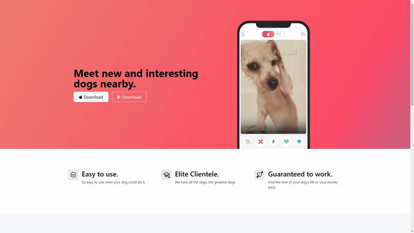

# TinDog - Tinder for Dogs

TinDog is a simple, responsive landing page designed for a fictional dog dating app using Bootstrap. It provides information about the app's features, testimonials, and pricing plans.

## Table of Contents
- [Demo](#demo)
- [Technologies Used](#technologies-used)
- [Features](#features)
- [Getting Started](#getting-started)
- [Installation](#installation)
- [Contributing](#contributing)


## Demo
You can view a live demo of the project [here.](#)



## Technologies Used
- HTML5
- CSS3
- Bootstrap 5
- JavaScript

## Features
- **Responsive Design**: The page is fully responsive and adjusts to various screen sizes including mobile, tablet, and desktop views.
- **Bootstrap Components**: Utilizes Bootstrap 5 components such as grid system, navigation bar, and cards for consistent styling and structure.
- **Simple Layout**: Contains basic sections like a navigation bar, hero section, features overview, pricing cards, testimonials, and a footer.
- **Custom Styling**: Basic custom CSS is used for additional styling beyond Bootstrap.

## Getting Started
To get started with this project, you can clone the repository and open the `index.html` file in your browser.

### Prerequisites
- Web browser (e.g., Chrome, Firefox)
- Internet connection for loading Bootstrap assets

## Installation
1. Clone the repository:
    ```bash
    git clone https://github.com/shafayat666/bootstrap-tindog.git
    ```
2. Open the `index.html` file in your preferred web browser.

## Contributing
If you want to contribute to this project, please fork the repository and submit a pull request.
